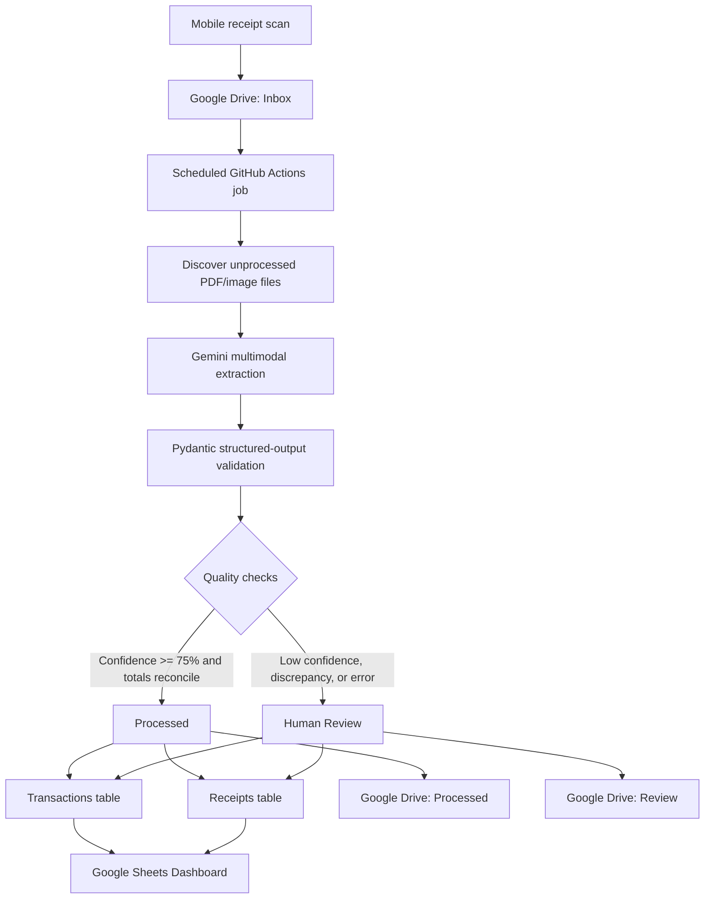

# Receipt Intelligence Pipeline

An automated multimodal data pipeline that converts unstructured household receipt
scans into validated, analysis-ready transaction data.

The system ingests PDF and image receipts from Google Drive, uses Gemini Vision for
line-item extraction and classification, validates the structured output, routes
uncertain records through a human-review workflow, and publishes clean tables to
Google Sheets for dashboarding. GitHub Actions runs the pipeline every night at
10:00 PM Mountain time.

> **Portfolio demo:** [View the sanitized Google Sheets dashboard](https://docs.google.com/spreadsheets/d/1n2MIY6Lcu8Pc98G_gy0XhrARapxfnnzQZvg1Yaf9KF0/edit?usp=sharing)
>
> The demo should contain synthetic or anonymized data only. Do not share the
> production spreadsheet, receipt images, Drive file IDs, or household purchase data.

## Why this project matters

Receipts are noisy semi-structured documents: merchant layouts vary, product names
are abbreviated, scans can be blurry, and a single receipt may contain items from
several spending categories. This project treats receipt processing as a production
data problem rather than a one-off model call.

It demonstrates:

- Multimodal document understanding with schema-constrained LLM output
- Data modeling at both receipt and transaction grain
- Automated validation and confidence-based human review
- Idempotent ingestion and failure recovery
- Cloud API integration, secret management, and scheduled orchestration
- Testable Python components around a nondeterministic model dependency

## Architecture



### Pipeline stages

1. **Ingestion:** Query the Drive `Inbox` for supported PDFs, JPEGs, PNGs, WebP,
   HEIC, and HEIF files.
2. **Model selection:** Discover Flash models available to the API key at runtime,
   favoring the newest stable model. An environment variable can pin a model for
   reproducible experiments.
3. **Structured extraction:** Send the original scan directly to Gemini—without a
   separate OCR layer—and constrain its output with Pydantic models.
4. **Semantic validation:** Require allowed categories, valid confidence values,
   positive quantities, normalized dates, and nonnegative monetary fields.
5. **Financial reconciliation:** Compare the sum of line-item totals with the printed
   receipt subtotal using a two-cent tolerance.
6. **Human-in-the-loop routing:** Highlight uncertain rows yellow and move their
   source files to `Review`; route validated receipts to `Processed`.
7. **Analytics publication:** Append transaction-grain and receipt-grain tables while
   leaving the `Dashboard` tab formula-driven and read-only to the pipeline.

## Data model

The pipeline separates receipt-level facts from item-level facts to avoid repeating
totals and processing metadata across every purchased item.

| Dataset | Grain | Example fields |
|---|---|---|
| `Transactions` | One row per purchased line item | Date, merchant, normalized item, quantity, unit price, total price, category, subcategory, confidence |
| `Receipts` | One row per source receipt | Drive file ID, filename, merchant, subtotal, tax, total, processing time, status |
| `Dashboard` | Aggregated analytical views | Category trends, spending summaries, review indicators |

### Budget taxonomy

The model is restricted to categories with an active monthly budget. All dining and
entertainment spending—including restaurants, takeout, cafes, movies, events, games,
and hobbies—is merged into `Date`. The separate zero-dollar `Entertainment` label is
therefore removed rather than mapped to `Other`. Other zero-dollar categories—such as
Clothing, Electronics, Home Improvement, Travel, and Education—are excluded from the
model schema and map to `Other`.

| Category | Monthly budget |
|---|---:|
| Rent | $700 |
| Utilities | $100 |
| Groceries | $250 |
| Date | $150 |
| Household | $20 |
| Personal | $20 |
| Health | $10 |
| Transportation | $60 |
| Gifts | $50 |
| Subscriptions | $7 |
| Other | $20 |
| **Total** | **$1,387** |

Restricting the label space makes downstream reporting stable and enables future
classification evaluation with precision, recall, and macro-F1.

## Quality and review logic

A receipt is routed to review when any of the following occurs:

- An item confidence score is below `0.75`
- Gemini flags the document for review
- Gemini reports that item totals do not match the subtotal
- The pipeline independently calculates a subtotal discrepancy greater than `$0.02`
- Required receipt information is missing or malformed
- A model or API error prevents extraction

All usable model output is still written to Sheets. Questionable transaction rows and
their receipt row are highlighted yellow so a person can correct them without
blocking the rest of the batch.

## Reliability engineering

- **Idempotency:** Google Drive file IDs prevent successfully handled files from
  producing duplicate transaction data.
- **Failure isolation:** One bad scan does not prevent other receipts in the batch
  from being processed.
- **Transient-error handling:** Retryable Gemini errors use two delayed retries of
  approximately ten seconds each, followed by a fallback to the next available Flash
  model when possible.
- **Model lifecycle resilience:** Runtime model discovery avoids depending on a
  retired hard-coded model name; `GEMINI_MODEL` supports deliberate pinning.
- **Schedule correctness:** Two UTC cron triggers plus an `America/Denver` local-time
  guard preserve a 10:00 PM run through daylight-saving changes.
- **Schema compatibility:** Existing extra Sheet columns are preserved, including a
  legacy blank `purchaser` field, so dashboard formulas are not shifted.
- **Secure configuration:** API keys, service-account credentials, folder IDs, and
  spreadsheet IDs are stored as GitHub Actions secrets rather than source code.

## Evaluation framework

The current repository validates deterministic pipeline behavior with unit tests.
For a model-quality study, I would build a manually labeled receipt set and track:

| Metric | What it measures |
|---|---|
| Field-level exact match | Merchant, date, quantity, and category extraction accuracy |
| Price MAE | Absolute error in extracted unit and line-item prices |
| Category macro-F1 | Performance across both common and infrequent spending classes |
| Receipt reconciliation rate | Share of receipts whose extracted items match the printed subtotal |
| Review precision | Share of flagged receipts that genuinely require correction |
| Straight-through processing rate | Share completed without human intervention |
| End-to-end latency and cost | Operational tradeoff by model and document type |

This separates software correctness from model quality and creates a framework for
comparing models, prompts, confidence thresholds, and scan quality.

## Technology stack

- Python 3.12
- Gemini API and `google-genai`
- Pydantic structured schemas
- Google Drive API
- Google Sheets API
- GitHub Actions
- Python `unittest`

## Repository guide

| File | Responsibility |
|---|---|
| `main.py` | Orchestration, batch isolation, status handling, and Drive routing |
| `categorize.py` | Prompt, model discovery, structured Gemini call, retries, and fallback |
| `models.py` | Typed receipt schema and deterministic review rules |
| `drive.py` | Drive discovery, download, and folder movement |
| `sheets.py` | Header-aware writes, idempotency lookup, and review highlighting |
| `config.py` | Environment configuration and validation |
| `.github/workflows/process-receipts.yml` | Scheduled and manual execution |
| `tests/test_pipeline.py` | Regression tests for schema, validation, retries, and scheduling |

## Local development

```bash
python -m venv .venv
source .venv/bin/activate
python -m pip install -r requirements.txt
python -m unittest discover -s tests -v
```

To run the pipeline locally, export the same environment variables used by GitHub
Actions and run:

```bash
python main.py
```

## Deployment configuration

Create a Google Cloud service account, enable the Google Drive and Google Sheets APIs,
and share the three receipt folders and target spreadsheet with the service-account
email as an editor. Add the following repository secrets under **Settings → Secrets
and variables → Actions**:

| Secret | Purpose |
|---|---|
| `GEMINI_API_KEY` | Gemini API authentication |
| `GOOGLE_SERVICE_ACCOUNT_JSON` | Complete Google service-account JSON credential |
| `GOOGLE_DRIVE_INBOX_FOLDER_ID` | Incoming receipt folder |
| `GOOGLE_DRIVE_PROCESSED_FOLDER_ID` | Validated receipt archive |
| `GOOGLE_DRIVE_REVIEW_FOLDER_ID` | Human-review queue |
| `GOOGLE_SHEETS_SPREADSHEET_ID` | Analytics workbook |
| `GEMINI_MODEL` | Optional explicit model override |

After configuring secrets, use **Actions → Process receipts → Run workflow** for a
manual test. Scheduled runs execute at 10:00 PM Mountain time.

## Limitations and next steps

- Create a labeled evaluation dataset and publish benchmark metrics
- Replace ad hoc manual corrections with an explicit approval/audit table
- Add merchant normalization and reusable item-category memory
- Track prompt/model versions with every processed receipt
- Add cost and latency telemetry by model and document type
- Build automated Dashboard charts from a sanitized demonstration dataset

## Privacy

Receipts contain sensitive behavioral and financial information. Production scans,
credentials, Drive identifiers, and household transactions must remain private. A
public portfolio demo should use generated or aggressively anonymized data and a
separate view-only spreadsheet.
